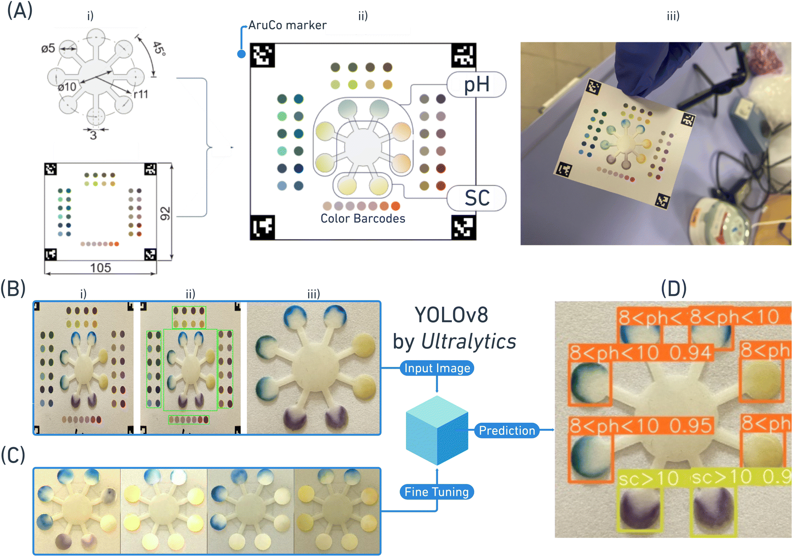
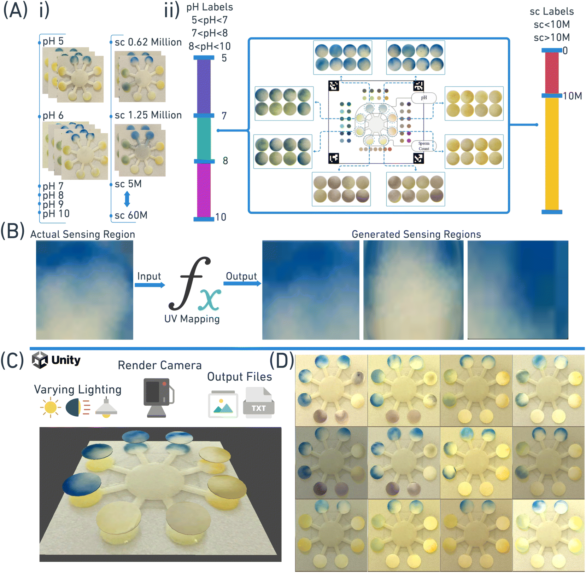
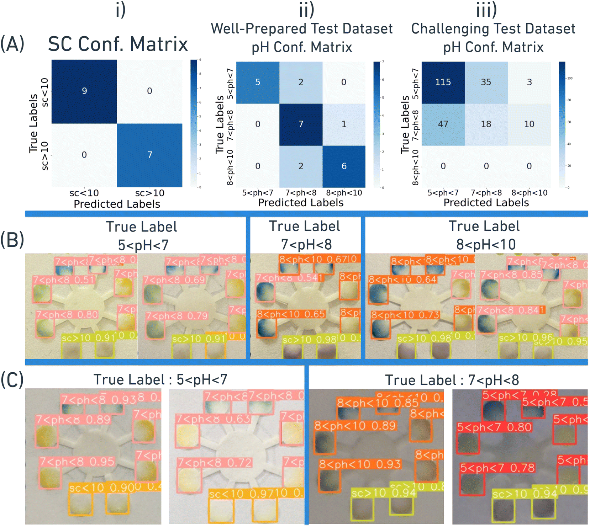

# 🧬 Synthetic Imagery and YOLOv8: Colorimetric Approach to Paper-Based PoC Male Fertility Testing

  

This repository documents a machine learning–augmented, paper-based **point-of-care (PoC) male fertility test**, where **synthetic image generation** and **YOLOv8** enable accurate detection and interpretation of colorimetric test results using a mobile phone camera.

📰 **Published in:**  
[Sensors & Diagnostics (RSC) – 2025](https://pubs.rsc.org/en/content/articlelanding/2025/sd/d4sd00348a)

---

## 🎯 Problem & Motivation

Colorimetric detection using smartphones is hindered by:
- Varying **lighting conditions**
- Camera **angle and lens distortion**
- Differences in **device color calibration**
- **Ambient light** interference

These factors lead to **inaccurate and inconsistent readings**, especially in tests requiring detection of subtle color differences.

---

## 📲 Solution Overview

We propose a novel pipeline using:
- **Procedural synthetic dataset generation**
- **YOLOv8 object detection and classification**
- A user-friendly **Python GUI** for real-time testing

---

## 🛠️ System Components

### 🧪 Paper-Based Sensor Design
- Colorimetric regions detect:
  - **Sperm concentration**
  - **pH level**
- Read using a smartphone camera under standardized capture protocol

### 🧠 Model: YOLOv8
- Trained on both **real** and **Unity-generated synthetic** datasets
- Multi-task classification for **semen quality** and **pH level**
- Robust across lighting and device conditions

---

## 🖥️ GUI Application

  

- Load captured or synthetic test image
- Run YOLOv8 prediction
- Visualize test results and bounding boxes
- Export data for analysis

---

## 🧪 Synthetic Data Generation

  

- Procedurally generated in **Unity**
- Incorporates:
  - Randomized **coffee ring patterns**
  - Diverse **lighting, angles, textures**
  - Controlled label distribution
- Enables training on **edge cases** and rare sample variations

---

## 📊 YOLOv8 Evaluation Results

  

- (A) Evaluation on protocol-compliant test images:
  - i) High sperm count classification accuracy
  - ii–iii) pH prediction confusion matrices
- (B) Misclassification visual analysis
- (C) Challenging image results and failure points

---

## 🔍 Applications

- At-home male fertility screening
- Fertility clinic pre-diagnostics
- Real-time mobile PoC testing
- AI-assisted reproductive health monitoring

---

## 📦 Repository Content

| File / Folder        | Description                                      |
|----------------------|--------------------------------------------------|
| `gui.py`             | Python GUI interface for image upload and model inference |
| `unity_synthetic/`   | Dataset generation pipeline (Unity project)     |
| `models/`            | Trained YOLOv8 weights and config files         |
| `images/`            | Sample test images and annotations              |

> 📌 Note: Code and model files not included in this public version. For access, contact the author.

---

## 🔒 License & Usage

This repository is shared **only for academic and portfolio purposes.**  
Reproduction, modification, or distribution is **strictly prohibited** without prior written consent.  
All rights reserved © 2025 Olgaç Özarslan - Savaş Taşoğlu

---
